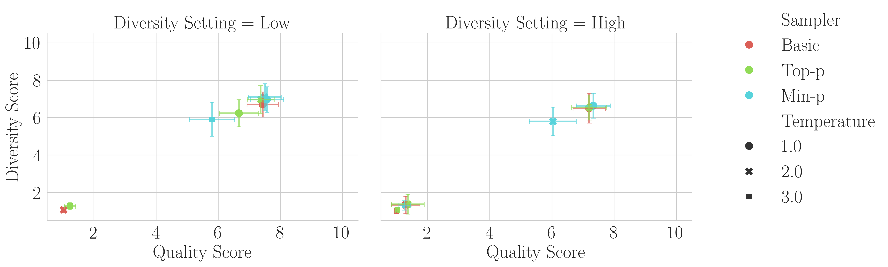

# Koyejo Lab Min-p Sampling

This repository contains code and figures for our Arxiv preprint [Min-p, Max Exaggeration: A Critical Analysis of Min-p Sampling in Language Models](https://arxiv.org/abs/2506.13681).
We investigate Nguyen et al. (2025)'s [Turning Up the Heat: Min-p Sampling for Creative and Coherent LLM Outputs](https://openreview.net/forum?id=FBkpCyujtS) and find what we believe are substantive flaws across all four lines of evidence: human evals, NLP benchmark evals, LLM-as-a-Judge evals and community adoption. We conclude that evidence presented in the original paper fails to support claims that min-p improves quality, diversity, or a trade-off between quality and diversity. 



[](https://arxiv.org/abs/2506.13681)

[**Installation**](#installation) | [**Usage**](#usage) | [**Citation**](#citation) | [**Contact**](#contact)

## Installation

1. (Optional) Update conda:

`conda update -n base -c defaults conda -y`

2. Create and activate the conda environment:

`conda create -n min_p_env python=3.11 -y && conda activate min_p_env`

3. Install the required packages:

`pip install vllm lm_eval wandb pandas seaborn nvidia-htop statsmodels`

or exactly install the versions we used:

`conda env create -f environment.yml`

4. (If running NLP benchmark evaluations) Sign into `wandb` with `wandb login`

## Usage

### Human Evaluations

### NLP Benchmark Evaluations

To evaluate a single model (to sanity check that the code runs), run:

`export PYTHONPATH=. && export CUDA_VISIBLE_DEVICES=0 && conda activate min_p_env && python -u scripts/run_one_eval.py`

To run the full evaluation, create a W&B sweep:

`wandb sweep PATH TO SWEEP YAML CONFIG`

And then launch an agent per GPU:

`export PYTHONPATH=. && export CUDA_VISIBLE_DEVICES=YOUR GPU NUMBER && conda activate min_p_env && wandb agent ...`

## Citation

To cite this work, please use:

```bibtex
@inproceedings{schaeffer2025minpmaxexaggeration,
      title={Min-p, Max Exaggeration: A Critical Analysis of Min-p Sampling in Language Models}, 
      author={Rylan Schaeffer and Joshua Kazdan and Yegor Denisov-Blanch},
      year={2025},
      eprint={2506.13681},
      archivePrefix={arXiv},
      primaryClass={cs.CL},
      url={https://arxiv.org/abs/2506.13681}, 
 }
```

## Contact

Questions? Comments? Interested in collaborating?
Open an issue or email rschaef@cs.stanford.edu or any of the other authors.
